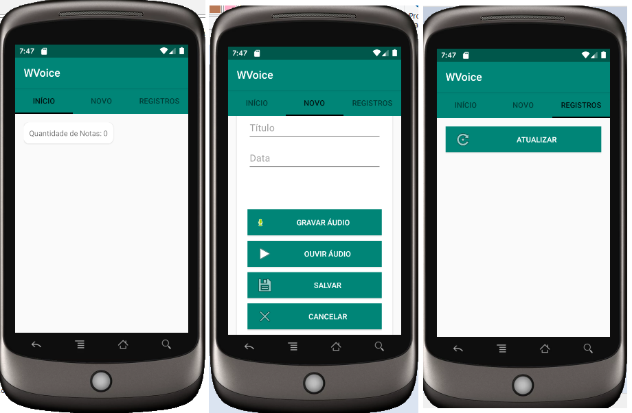

# App WVoice
Aplicativo que possui intuito em automatizar e facilitar a construção de bloco de notas, utilizando reconhecimento de voz e reprodutor de voz.

# ScreenShots

# Recursos Utilizados
- Kotlin 
- Voice Recognizer
- Text to Speech
- Sqlite Database
